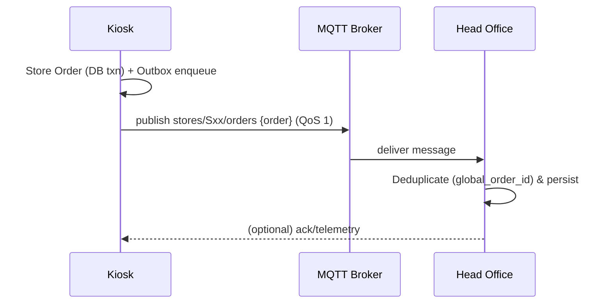
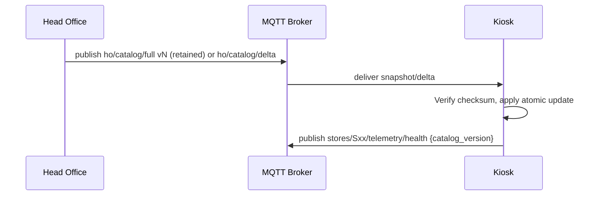

# Multi‑Store Local POS + Head Office via MQTT

This document outlines how to deploy the Django ePOS across 15 locally hosted kiosks and synchronize with Head Office (HO) using MQTT for manage_orders and update_till data.

## Goals
- Each kiosk runs locally for low latency and offline resilience.
- Head Office curates catalog (products, VAT, price bands) and aggregates sales/exports.
- Asynchronous, durable MQTT sync: kiosks publish orders and summaries; HO publishes catalog/config and commands.

## High‑level architecture

```mermaid
graph LR
  subgraph K [Kiosk (x15)]
    K1[Local Django<br/>manage_orders / update_till]
    K2[(Local DB<br/>SQLite or Postgres)]
    K3[MQTT Client<br/>(pub/sub, durable outbox)]
    K1 <--> K2
    K1 <--> K3
  end

  K3 -->|orders, daily summary, health| B[MQTT Broker<br/>(TLS, ACL)]
  B -->|catalog snapshots/deltas, commands, config| K3

  B --> I[HO Ingestion/Aggregation<br/>(worker)]
  I --> D[(HO DB<br/>Postgres)]
  I --> C[Catalog Service]
  C -->|publish snapshots/deltas| B
  I --> A[HO Admin/Dashboard]
```

## Dataflows

### Orders (Upstream)



### Catalog updates (Downstream)



## Topics (suggested)
- Downstream (HO→Kiosk)
  - `ho/catalog/full/v{n}` — full snapshot (retained)
  - `ho/catalog/delta/{store_code}` — targeted overrides
  - `ho/cmd/{store_code}` — ops commands (resync, rotate, ping)
  - `ho/config/{store_code}` — feature flags / pricing toggles
- Upstream (Kiosk→HO)
  - `stores/{store_code}/orders` — orders (JSON, single or batch)
  - `stores/{store_code}/daily/exports` — MP/PD/RV/K_WK_VAT summaries
  - `stores/{store_code}/telemetry/health` — heartbeat (uptime, versions)
  - `stores/{store_code}/telemetry/errors` — error events

## Message schemas (examples)

Order
```json
{
  "global_order_id": "S03-20251127-000123",
  "store_code": "S03",
  "created_at": "2025-11-27T15:42:11Z",
  "price_band": 1,
  "vat_basis": "take",
  "payment_method": "Cash",
  "lines": [
    {
      "item_code": 44,
      "item_type": "product",
      "qty": 1,
      "is_meal": false,
      "unit_price_gross": 560,
      "line_total_gross": 560,
      "meta": { "free_choices": [41] }
    }
  ],
  "totals": { "gross": 560, "net": 560, "vat": 0 }
}
```

Catalog snapshot
```json
{
  "catalog_version": 1733018400,
  "price_bands": [...],
  "products": [...],
  "combos": [...],
  "vat": [...],
  "checksum": "sha256:..."
}
```

Daily summary
```json
{
  "date": "2025-11-27",
  "store_code": "S03",
  "krev": { /* TCASHVAL, ... */ },
  "kpro": [ /* counts */ ],
  "kmeal": [ /* meal counts */ ],
  "kwkvat": [ /* vat by class */ ],
  "source_catalog_version": 1733018400
}
```

## Kiosk node design
- Web app: Django (this repo) via gunicorn/uvicorn or Windows service.
- DB: SQLite (simple) or Postgres (better concurrency). Backups to disk.
- MQTT client worker:
  - Durable outbox table (pending → sent, retry with backoff).
  - Subscriber applies catalog (checksum + transactional swap).
- Scheduler: run `build_daily_stats` + `export_daily_csvs` at close.
- Health telemetry every 60s (catalog_version, outbox depth, app version).

## Head Office design
- MQTT broker (Mosquitto/EMQX/HiveMQ) with TLS + ACLs.
- Ingestion worker (Celery/APScheduler) writes to HO DB, idempotent.
- Catalog publisher (full + delta), retained full for cold-start kiosks.
- Admin/Dashboard for multi-store ops and alerts.

## Security
- TLS for MQTT; per-kiosk credentials or client certs.
- ACLs: kiosk S03 can publish `stores/S03/#`, subscribe `ho/#` scoped to S03.
- Optional payload signing for catalog snapshots.
- Credential rotation policy.

## Observability
- Metrics: outbox depth, last heartbeat, catalog drift, ingest latency.
- Alerts: no heartbeat > 5m, outbox depth > N, high publish error rate.

## Deployment
- Kiosk env vars: STORE_CODE, MQTT_HOST/PORT, MQTT_USER/PASS, DJANGO_SECRET_KEY, DB_PATH.
- Systemd services (or Windows services): web, sync worker, scheduler.
- HO: Postgres, broker, ingestion worker, catalog publisher, dashboard.

## Rollout sequence
1) Add store_code + global_order_id; implement outbox + subscriber.
2) Define schemas + topics; integrate paho-mqtt.
3) Build health telemetry; apply full snapshot from retained topic.
4) Pilot 1–2 kiosks; load test offline/flush; secure TLS & ACL.
5) Roll out in waves and monitor.

## Edge cases
- Offline backlog flush with rate limiting.
- Atomic catalog apply (integrity + checksum); revert on failure.
- Price band changes mid-day tracked by catalog_version on orders.

---

Tip: Keep the catalog full snapshot retained in the broker so a new kiosk can boot, subscribe, and apply without HO intervention.
